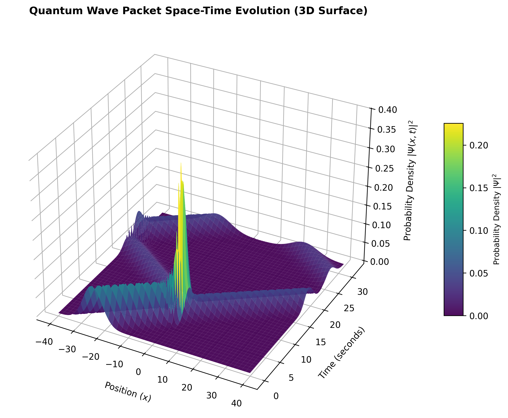
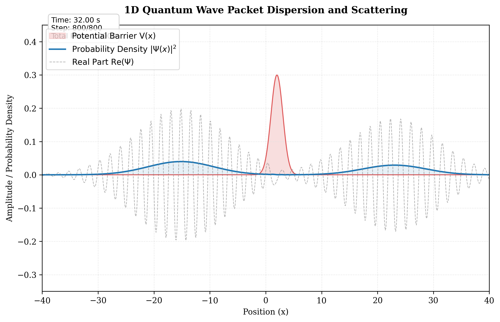

# 1D Quantum Simulation (Quantum Tunneling & Scattering)

This repository contains a numerical simulation of the 1D Time-Dependent Schrödinger Equation (TDSE) modeling the propagation of a Gaussian quantum wave packet scattering off a potential barrier.

The simulation is solved using the highly stable and accurate **Split-Step Fourier Method (SSFM)**.

## Key Features
- **Live Animation (GUI Mode)**: When run on a local machine, the simulation displays a real-time visualization of the wave packet's dynamics.
- **Headless Mode**: If run in a headless environment, the script automatically detects the absence of a GUI and saves the simulation plots directly to disk.
- **Scientific Visualization**: Generates two types of high-precision publication-quality plots.

---

## Simulation Results

### 1. Space-Time Evolution (3D Surface Plot)
Displays the complete time evolution of the wave packet, showing its propagation, reflection, and quantum tunneling:


### 2. Final State Plot
Displays the probability density $|\Psi(x)|^2$ and the real part $\text{Re}(\Psi)$ at the final time step:


---

## Getting Started

### 1. Install Dependencies
Ensure you have the required Python libraries installed:
```bash
pip install numpy matplotlib scipy
```

### 2. Run the Script
Run the following command in your terminal to view the live animation:
```bash
python3 quantum_simulation.py
```
*(Close the graphics window to finish the simulation and save the plots).*
